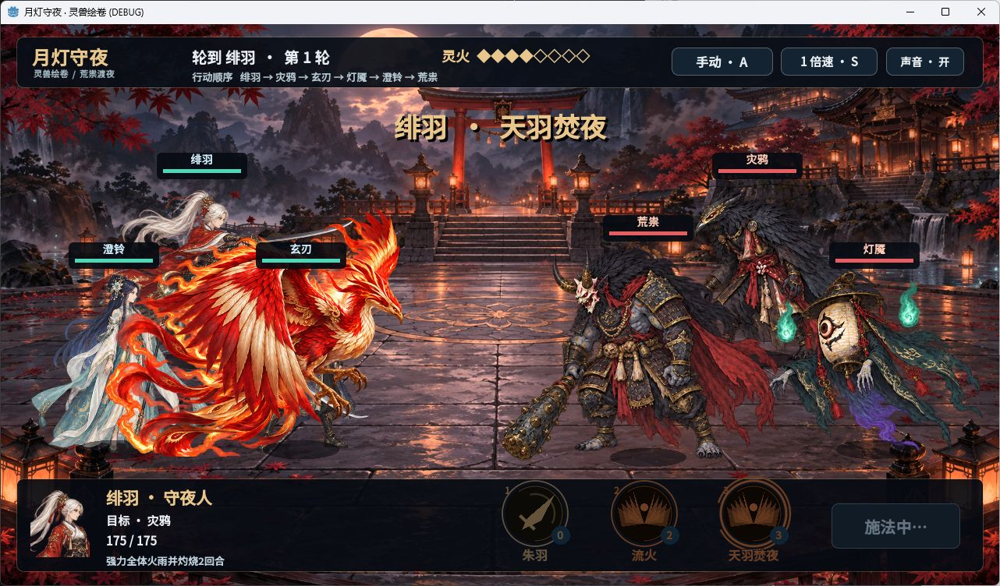

# 月灯守夜 · Moonlit Vigil

一个与 **Codex** 协作制作的和风 **2D 回合制战斗原型**。三位守夜人守住月夜神社，共享灵火、选择技能、打断首领、治疗与护盾，打一场完整的 3v3 战斗。

**[下载 Windows 版](https://github.com/kennysu9598/moonlit-vigil/releases/tag/v0.4.0)** · **[参与开发](CONTRIBUTING.md)** · **[素材与许可](ASSET_LICENSES.md)**



## 直接玩

1. 打开上面的下载页，下载 `MoonlitVigil-v0.4.0-windows-x86_64.zip`。
2. 完整解压，保持 `MoonlitVigil.exe` 与 `MoonlitVigil.pck` 在同一目录。
3. 双击 exe，按 Enter 开战。界面为中文；本版是 Windows x86_64 便携原型。

| 操作 | 按键 |
|---|---|
| 开始 / 施放 | Enter |
| 选择技能 | 1 / 2 / 3 |
| 选择目标 | 鼠标点人物 / Tab |
| 手动 / 自动 | A |
| 1× / 2× / 3× | S |
| 静音 | M |
| 胜败后重玩 | R |

## 怎么做出来的

- **Godot 4.7.2 + GDScript**：战斗规则、界面、角色行动、环境与特效。
- **Codex + AI image generation**：在人的方向和质量反馈下拆任务、写代码、制作项目画作、迭代动作和核验；用独立审查辅助验收。
- **2D 动画**：凤凰四个真正不同的振翅姿态配合尾羽运动；龙用分段纹理网格，让躯干与尾部错相游动。它们是画作动画，不是完整 3D 模型。
- **Kenney / OpenGameArt**：CC0 音效和 Emma_MA 的战斗曲；**Noto Sans SC**：OFL 字体。
- **参考方向**：《阴阳师》的和风战斗氛围与演出节奏，以及 Godot 官方文档、开源游戏/VFX方法。这个仓库不包含原游戏角色、贴图、音乐或参考素材库。

早期尝试过 3D 路线；本仓库单独发布当前可玩的 2D 版本。运行无需 AI 服务、API key、ComfyUI 或付费账号。

## 自己改 / 一起开发

安装 Godot **4.7.2**（Standard 版本，非 .NET），然后：

```sh
git clone https://github.com/kennysu9598/moonlit-vigil.git
cd moonlit-vigil
godot --editor --path .
```

也可以在 Godot 项目管理器里导入根目录的 `project.godot`，等待素材导入后按 F5 运行。Windows 下可以使用 Godot 控制台 exe 的完整路径代替 `godot`。仓库已包含运行需要的全部画作、声音和字体。

欢迎 Fork、提 Issue 和 Pull Request。可从动画、其余技能特效、音效体验、UI、平衡或跨平台兼容开始；具体见 [贡献指南](CONTRIBUTING.md) 和 [路线图](docs/ROADMAP.md)。

## 当前边界

这是 **v0.4.0 原型**，完成一场战斗，不是完整商业 RPG。两套灵兽主特效已通过本轮画面检查；其他未达到人物精细度的主特效保持关闭，技能规则仍可使用。凤凰只有四个关键姿态；人物也是有限姿态动画。Windows 包使用 Godot GUI 运行器 + PCK，可能显示 DEBUG 标题。Mac/Linux 尚未发行、未实测。

已做 100 种子战斗逻辑、100 种子自动策略测试、局部动画检查，以及 Windows 实际输入从开场到胜利与重玩。真实试玩包含手动与自动模式；详见 [测试说明](docs/TESTING.md)。

## 许可

项目代码和本项目拥有权利的原创内容以 **MIT** 开放，允许学习、修改和再分发；第三方音效/音乐保持 **CC0**，字体保持 **OFL-1.1**，Godot 保持自身 MIT 与第三方声明。详见 [LICENSE](LICENSE) 与 [ASSET_LICENSES.md](ASSET_LICENSES.md)。AI 生成美术已明确标注来源。
